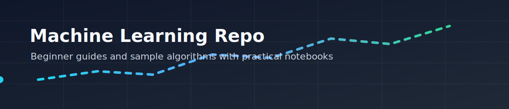
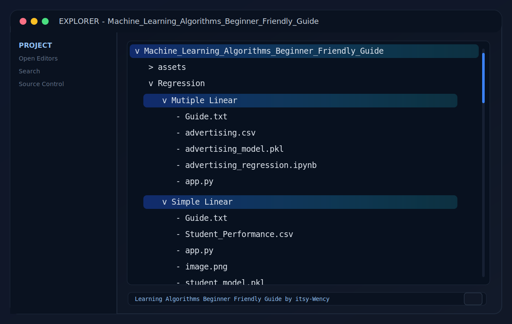

# Machine Learning Algorithms Beginner Friendly Guide

<p align="center">
  
</p>

<p align="center">
  Beginner-friendly guides and sample projects for practical machine learning algorithms.
</p>

<p align="center">
  
  
  
</p>

<p align="center">
  
</p>

## Purpose

This repository provides beginner-friendly, step-by-step machine learning walkthroughs with runnable notebooks.

Goals:
- learn one concept at a time
- run complete examples end-to-end
- understand outputs, metrics, and plots with plain-English interpretation

## Who This Is For

- Students starting machine learning
- Self-learners building practical intuition
- Anyone who wants guided notebooks with clear explanations

## Current Content

| Topic | Type | Path |
| --- | --- | --- |
| Simple Linear Regression | Guide | [Guide.txt](./Regression/Simple%20Linear/Guide.txt) |
| Simple Linear Regression | Notebook | [student_scores_regression.ipynb](./Regression/Simple%20Linear/student_scores_regression.ipynb) |
| Simple Linear Regression | Dataset | [Student_Performance.csv](./Regression/Simple%20Linear/Student_Performance.csv) |
| Multiple Linear Regression | Guide | [Guide.txt](./Regression/Mutiple%20Linear/Guide.txt) |
| Multiple Linear Regression | Notebook | [advertising_regression.ipynb](./Regression/Mutiple%20Linear/advertising_regression.ipynb) |
| Multiple Linear Regression | Dataset | [advertising.csv](./Regression/Mutiple%20Linear/advertising.csv) |

## Quick Start

1. Clone the repository.
2. Install dependencies:

```bash
pip install pandas matplotlib seaborn scikit-learn notebook
```

3. Open one notebook:
- `Regression/Simple Linear/student_scores_regression.ipynb`
- `Regression/Mutiple Linear/advertising_regression.ipynb`

4. Run all cells in order.
5. Read the explanation markdown after each code block.

## Notebook Learning Format

The notebooks are organized for teaching flow:
- code cells for each step
- markdown explanations directly after code
- output interpretation notes
- figure and diagram interpretation notes

## Learning Roadmap

- [x] Simple Linear Regression
- [x] Multiple Linear Regression
- [ ] Logistic Regression
- [ ] Decision Tree
- [ ] Random Forest
- [ ] K-Nearest Neighbors
- [ ] Naive Bayes
- [ ] Support Vector Machine
- [ ] K-Means Clustering
- [ ] Principal Component Analysis

## Latest Updates

### April 16, 2026

- Enhanced both regression notebooks with education-focused markdown blocks after code cells.
- Added explicit output interpretation notes to explain tables, metrics, and printed values.
- Added figure interpretation notes for scatter plots, histograms, correlation heatmaps, pairplots, and residual plots.
- Improved wording in a few notebook interpretation lines for clearer beginner guidance.
- Updated this README to include Multiple Linear Regression content and revised project structure.
- Added all README visual assets from `assets/` to improve presentation and navigation flow.

## Project Structure

<p align="center">
  
</p>

<p align="center">
  
</p>


## Contributing

Contributions are welcome, especially beginner-friendly examples that include:
- a short concept explanation
- a clean notebook with reproducible steps
- output and metric interpretation in plain language

## Notes

- Keep examples practical and simple first.
- Favor readable code over clever code.
- Design each new topic so a beginner can complete it in one sitting.
